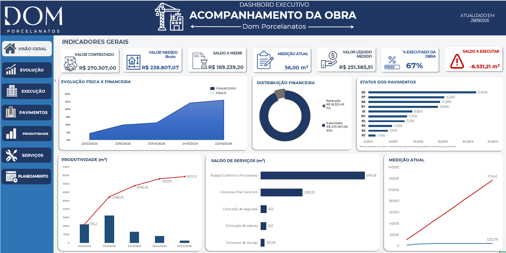

# Dashboard Executivo - Acompanhamento da Obra

## 📊 Sobre o Projeto
Dashboard desenvolvido em Excel para acompanhamento físico e financeiro de obras, com foco em indicadores gerenciais e visualização estratégica de dados.

## 🛠 Ferramentas Utilizadas
- Microsoft Excel
- Tabela Dinâmica
- KPIs
- Segmentação de Dados
- Fórmulas avançadas
- Dashboard Executivo

## 📌 Indicadores Apresentados
- Valor contratado
- Valor medido
- Saldo a medir
- Evolução física e financeira
- Distribuição financeira
- Produtividade
- Status dos pavimentos

## 🎯 Objetivo
Facilitar o acompanhamento executivo da obra através da análise visual de indicadores estratégicos.

## 📷 Preview do Dashboard

